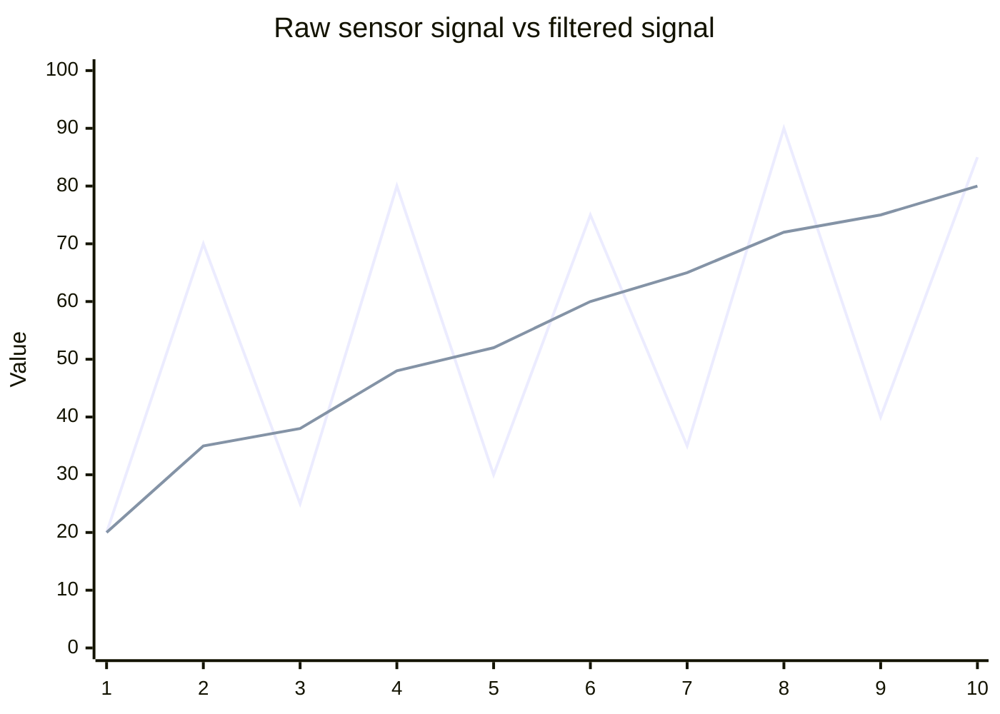
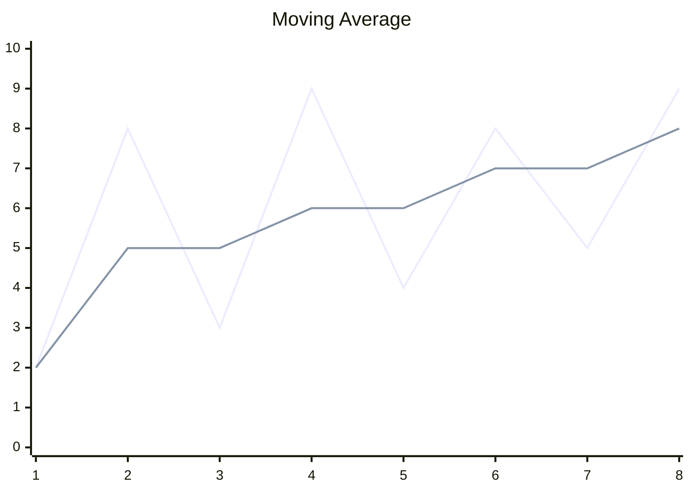
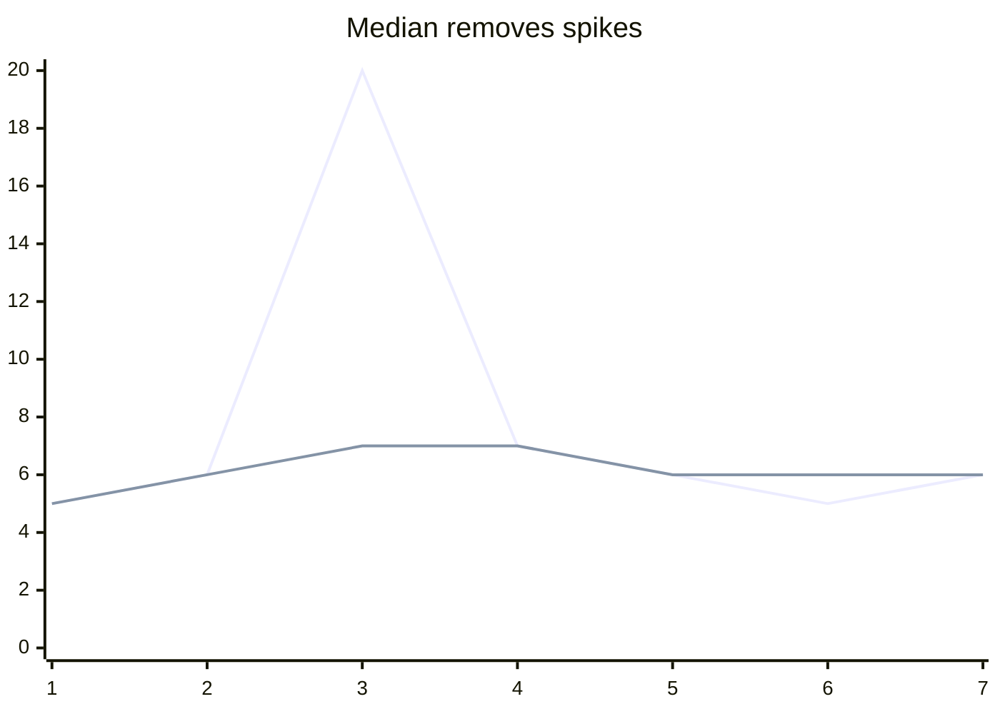
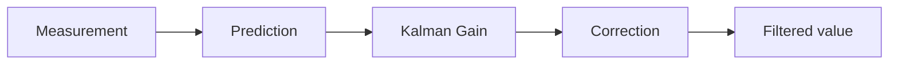
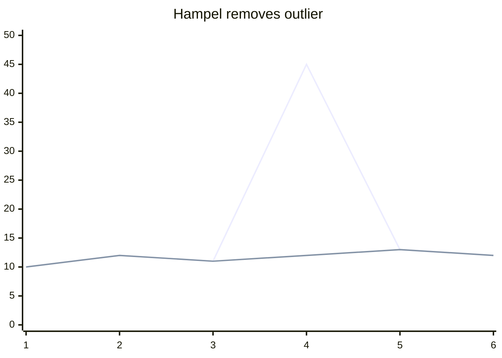

# Noise-filters

## Visual handbook of signal filtering algorithms

A C# library containing practical algorithms for cleaning noisy measurements, sensor data and industrial signals.

The goal of this repository is not only implementation, but also **understanding how filters change a real signal**.

---

# Signal filtering concept

Raw measurements usually contain:

- useful signal
- random noise
- spikes / outliers
- measurement jitter
- drift

Example:



---

# Implemented algorithms

| Algorithm | Noise type | Delay | CPU cost | Typical usage |
|-|-|-|-|-|
| Average | Random noise | Medium | Very low | Basic sensors |
| Moving Average | Random noise | Medium | Low | Telemetry |
| Exponential Average | Random noise | Low | Very low | Embedded |
| Median | Spikes | Medium | Low | Industrial sensors |
| Kalman | Dynamic systems | Low | Medium | Tracking |
| Alpha-Beta | Motion estimation | Low | Low | Robotics |
| Least Squares | Trend noise | High | Medium | Calibration |
| Gaussian | High frequency noise | Medium | Medium | Signal processing |
| Hampel | Outliers | Low | Medium | Fault detection |
| Savitzky-Golay | Shape distortion | Low | Medium | Scientific data |
| Deadband | Small oscillations | Zero | Very low | Control systems |

---

# Filter comparison

## Moving Average

Removes random fluctuations by averaging recent samples.



Advantages:

+ extremely simple
+ works on microcontrollers
+ predictable

Disadvantages:

- introduces delay
- destroys sharp changes

---

# Median filter

Best against impulse noise.



---

# Kalman family

Used when the signal has a model and prediction is possible.



---

# Advanced filters

## Weighted Moving Average

Gives different importance to samples.

Useful when newer measurements are more valuable.

## Gaussian Filter

Smooths high frequency noise using Gaussian weights.

## Hampel Filter

Robust removal of abnormal measurements.

Example:



## Savitzky-Golay

Preserves signal shape better than ordinary averaging.

Used in:

- spectroscopy
- scientific measurements
- industrial analysis

## Deadband filter

Ignores insignificant changes.

Example:

```
Input:
10.00
10.01
10.02
10.01

Output with deadband 0.05:
10.00
10.00
10.00
10.00
```

---

# Interactive playground (planned)

Future version will include a browser playground:

- generate noisy signal
- select filter
- change parameters
- compare response
- measure delay
- measure noise reduction

---

# Library structure

```
Filters/
 ├── BasicFilters.cs
 ├── AdvancedFilters.cs
 ├── StatisticalFilters.cs
 ├── SignalFilters.cs
 └── Examples/
```

---

# Applications

- Industrial automation
- PLC systems
- Robotics
- IoT devices
- Embedded controllers
- Measurement equipment
- Computer vision preprocessing

---

# Philosophy

A filter is always a compromise between:

```
Noise reduction <-----> Signal preservation <-----> Response speed
```

The correct algorithm depends on the physical process, sensor and required response time.
