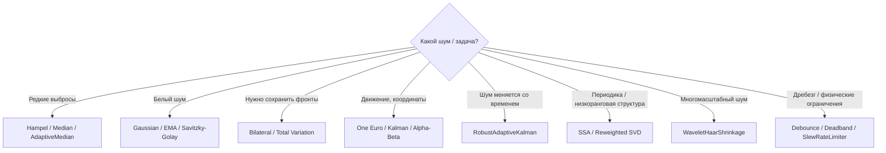

# Noise Filters — исследовательская библиотека фильтрации 1D-сигналов на C#

[](https://github.com/Mika-dot/Noise-filters)
[](https://github.com/Mika-dot/Noise-filters/tree/feature/advanced-noise-filters)
[](https://github.com/Mika-dot/Noise-filters/tree/feature/recent-denoising-2026)

Репозиторий — это не один фильтр, а последовательное исследование способов очистки одномерных измерительных сигналов: от простого среднего и медианы до Hampel, Savitzky–Golay, One Euro, Kalman, SSA, wavelet shrinkage, total variation и адаптивного SVD.

`main` используется как **витрина и карта всех веток**. Реализации более новых алгоритмов находятся в исследовательских ветках и не скрыты за одним огромным файлом.

## Ветки

| Ветка | Назначение | Что внутри |
|---|---|---|
| [`main`](https://github.com/Mika-dot/Noise-filters/tree/main) | Исторический baseline | Первые фильтры, исходные графики, `filtration.cs` |
| [`feature/advanced-noise-filters`](https://github.com/Mika-dot/Noise-filters/tree/feature/advanced-noise-filters) | Расширенная библиотека | 30 современных практических фильтров, единый API, тесты, CI, examples, интерактивная лаборатория, benchmark |
| [`feature/recent-denoising-2026`](https://github.com/Mika-dot/Noise-filters/tree/feature/recent-denoising-2026) | Новое исследование 2024–2026 | Wavelet shrinkage, SSA, reweighted SVD, TV-denoising, robust adaptive Kalman, свежий benchmark и обзор литературы |

> Важное замечание: benchmark-цифры разных веток получены на **разных детерминированных сценариях**. Их нельзя напрямую сравнивать между таблицами как единый рейтинг.

---

## Быстрый выбор алгоритма



| Сценарий | Начать с | Сильная сторона | Основной минус |
|---|---|---|---|
| Импульсные пики | `Hampel` | Меняет только аномальные точки | Нужно выбрать окно/threshold |
| Плотный impulse noise | `Median` | Почти не зависит от амплитуды выброса | Съедает тонкие детали |
| Обычный шум датчика | `EMA` / `Gaussian` | Просто, быстро, предсказуемо | Задержка / размытие |
| Сохранить форму гладкого пика | `SavitzkyGolay` | Локальная полиномиальная модель | Плохо переносит сильные выбросы |
| Сохранить резкую ступень | `Bilateral` / `TotalVariationDenoise` | Edge-preserving | Нелинейность / вычислительная цена |
| Координаты мыши/pose/tracker | `OneEuro` | Ослабляет сглаживание при быстром движении | Нужна настройка cutoff/beta |
| Известны дисперсии шума | `ScalarKalman` | Физически интерпретируемые параметры | Модель должна соответствовать процессу |
| Дисперсия шума плавает + выбросы | `RobustAdaptiveKalman` | Онлайн-адаптация `R` + robust innovation | Всё ещё простая scalar-state модель |
| Периодический/структурный batch-сигнал | `SSA` | Выделяет низкоранговую структуру | O(L²K + L³), не MCU-фильтр |
| Нужен мягкий low-rank shrinkage | `ReweightedSvdDenoise` | Не требует жёсткого отсечения rank | Batch и дороже оконных методов |
| Многомасштабный высокочастотный шум | `WaveletHaarShrinkage` | Локализация по масштабу | Haar грубее Daubechies/Symlet |

---

# 1. `main` — исходные алгоритмы

Историческая реализация находится в [`Filters/Filters/filtration.cs`](Filters/Filters/filtration.cs). Она сохранена как baseline для сравнения с дальнейшими ветками.

| Метод | Тип | Онлайн | Особенность |
|---|---|:---:|---|
| `NoiseCalculation` | диагностическая эвристика | ✓ | Оценка типичного шума и крупных выбросов |
| `Average` | box average | — | Простое усреднение окна |
| `StretchedSelection` | block average / sample-and-hold | ✓ | Новое среднее только после накопления блока |
| `RunningAverage` | moving average | ✓ | Кольцевой буфер последних отсчётов |
| `ExponentialRunningAverage` | EMA/IIR | ✓ | Минимум памяти, настраиваемая инерция |
| `AdaptiveFactor` | adaptive EMA | ✓ | Коэффициент зависит от отклонения нового измерения |
| `MedianFilter` | median | зависит | Устойчив к impulse noise |
| `LeastSquareMethod2` | linear LSQ | — | Линейная аппроксимация + RMS error |
| `LeastSquareMethod3` | quadratic LSQ | — | Квадратичная аппроксимация + RMS error |
| `SimpleKalman` | scalar adaptive-like Kalman | ✓ | Лёгкий трекер без полной state-space модели |
| `AlphaBetaFilter` | α–β tracker | ✓ | Значение + скорость |

### Исторические графики

<table>
<tr>
<td></td>
<td></td>
</tr>
<tr>
<td></td>
<td></td>
</tr>
</table>

Все старые графики: [`Filter in charts/`](https://github.com/Mika-dot/Noise-filters/tree/main/Filter%20in%20charts).

---

# 2. `feature/advanced-noise-filters` — расширенная библиотека

Ветка: **[`feature/advanced-noise-filters`](https://github.com/Mika-dot/Noise-filters/tree/feature/advanced-noise-filters)**

Это основная практическая версия библиотеки: `double[]` / `IReadOnlyList<double>`, проверка параметров, mirror boundary handling, .NET Standard 2.0, dependency-free tests, examples, CI и интерактивная HTML-лаборатория.

## BasicFilters

| Метод | Сложность | Онлайн | Особенность |
|---|---:|:---:|---|
| `MovingAverage` | O(n) | ✓ | Причинное скользящее среднее |
| `CenteredMovingAverage` | O(n·w) | — | Симметричное окно |
| `WeightedMovingAverage` | O(n·w) | зависит | Произвольные веса |
| `TriangularMovingAverage` | O(n·w) | — | Больший вес центральным точкам |
| `ExponentialMovingAverage` | O(n) | ✓ | Классический EMA |
| `DoubleExponentialMovingAverage` | O(n) | ✓ | Частичная компенсация lag |
| `HoltLinearTrend` | O(n) | ✓ | Уровень + линейный тренд |
| `Median` | O(n·w log w) | — | Робастность к выбросам |
| `Percentile` | O(n·w log w) | — | Квантильная огибающая |
| `Mode` | O(n·w) | — | Полезен для квантованных/дискретных измерений |

## RobustFilters

| Метод | Идея | Лучше всего для |
|---|---|---|
| `Hampel` | local median + MAD | Редкие выбросы |
| `MedianAbsoluteDeviationCleaner` | global robust z-score | Очистка конечной выборки |
| `SigmaClip` | итеративный mean/std clip | Почти Gaussian data |
| `TukeyFence` | IQR fences | Ограничение хвостов |
| `TrimmedMean` | удалить хвосты окна | Смешанный шум |
| `WinsorizedMean` | прижать хвосты | Плавный robust average |
| `AdaptiveMedian` | окно растёт до надёжной медианы | Переменная плотность impulse noise |

## SignalFilters

| Метод | Класс | Ключевая особенность |
|---|---|---|
| `Gaussian` | symmetric FIR | Гладкое частотное подавление |
| `SavitzkyGolay` | local polynomial | Сохраняет форму пиков/производные |
| `Fir` | FIR | Пользовательские коэффициенты |
| `LowPassRc` | 1st-order IIR LPF | Простая физическая RC-модель |
| `HighPassRc` | 1st-order IIR HPF | Удаление DC/slow drift |
| `Complementary` | sensor fusion | Смешение low/high-frequency источников |
| `OneEuro` | adaptive LPF | Малый lag при движении |
| `Bilateral` | nonlinear edge-preserving | Не смешивает сильно разные уровни |
| `Deadband` | nonlinear control | Игнорирует мелкую вибрацию |
| `SlewRateLimiter` | physical limiter | Ограничивает невозможную скорость изменения |
| `Debounce` | state stabilizer | Дребезг дискретного сигнала |

## StateEstimationFilters

| Метод | Состояние | Сценарий |
|---|---|---|
| `ScalarKalman` | value + variance | Скалярный датчик с постоянными Q/R |
| `AlphaBeta` | position + velocity | Быстрый дешёвый tracker |

`AdvancedFilters` оставлен как compatibility facade для старых вызовов.

### Advanced benchmark


Сценарий advanced-ветки: 600 отсчётов, 50 Гц, сумма синусов, ступень, Gaussian noise σ=5.2 и 25 выбросов, seed `20260824`.

| Фильтр | RMSE | Снижение ошибки | Оценка lag |
|---|---:|---:|---:|
| Median | **2.62** | 75.76% | 0 |
| Moving average | 3.61 | 66.54% | 1 |
| Gaussian | 4.26 | 60.59% | 1 |
| EMA | 4.57 | 57.73% | 6 |
| Savitzky–Golay | 5.34 | 50.57% | 1 |
| Hampel | 5.45 | 49.53% | 0 |
| Kalman | 5.88 | 45.61% | 10 |
| One Euro | 7.70 | 28.70% | 4 |


Исходные данные: [`benchmark.csv`](https://github.com/Mika-dot/Noise-filters/blob/feature/advanced-noise-filters/docs/charts/benchmark.csv).

Интерактивная лаборатория: [`docs/index.html`](https://github.com/Mika-dot/Noise-filters/blob/feature/advanced-noise-filters/docs/index.html).

---

# 3. `feature/recent-denoising-2026` — новые методы и свежая литература

Ветка: **[`feature/recent-denoising-2026`](https://github.com/Mika-dot/Noise-filters/tree/feature/recent-denoising-2026)**

Новый файл: [`ModernDenoisingFilters.cs`](https://github.com/Mika-dot/Noise-filters/blob/feature/recent-denoising-2026/Filters/Filters/ModernDenoisingFilters.cs).

| Метод | Семейство | Онлайн | Что исследуется |
|---|---|:---:|---|
| `WaveletHaarShrinkage` | multiresolution wavelet | — | MAD noise estimate + universal soft/hard threshold |
| `SingularSpectrumAnalysis` | SSA / low-rank | — | Hankel embedding + truncated signal subspace |
| `ReweightedSvdDenoise` | adaptive weighted SVD | — | Мягкое подавление слабых singular components вместо жёсткого rank cut |
| `TotalVariationDenoise` | ROF / TV | — | Edge-preserving denoising для piecewise-smooth сигналов |
| `RobustAdaptiveKalman` | adaptive state estimation | ✓ | Онлайн-оценка measurement noise + Huber-style downweighting выбросов |

### Что подсказала литература 2024–2026

Современные публикации всё чаще переходят от одного фиксированного LPF к гибридам: adaptive decomposition + wavelet threshold, SVD/SSA с автоматическим выбором компонент и Kalman с меняющейся оценкой ковариации шума.

Ветка опирается как направление исследования, в частности, на:

- Sensors 2025: adaptive/reweighted SVD для vibration denoising — DOI `10.3390/s25082470`;
- Applied Sciences 2025: adaptive SVD в time + frequency domains — DOI `10.3390/app152212034`;
- IEEE Sensors Journal 2024: robust adaptive Sage–Husa/variational Kalman — DOI `10.1109/JSEN.2024.3421271`;
- Sensors 2026: parameter-adaptive VMD + wavelet threshold — DOI `10.3390/s26133974`;
- Sensors 2026: ICFO–SVMD + improved wavelet threshold — DOI `10.3390/s26020750`;
- arXiv 2026: differentiable time-varying IIR filtering for low-latency denoising — `arXiv:2603.02794`.

Полный разбор и ограничения: [`docs/RESEARCH_2026.md`](https://github.com/Mika-dot/Noise-filters/blob/feature/recent-denoising-2026/docs/RESEARCH_2026.md).

### Recent benchmark

Сценарий: 600 отсчётов при 50 Гц; две синусоиды, ступень, медленный drift; Gaussian noise σ=1.6; 22 impulse outliers; seed `20260905`.


| Фильтр | RMSE | MAE | RMSE возле выбросов | RMSE вне выбросов |
|---|---:|---:|---:|---:|
| Reweighted SVD | **0.8358** | **0.6339** | 1.5169 | **0.7168** |
| SSA rank 6 | 0.8523 | 0.6687 | **1.1597** | 0.8094 |
| Savitzky–Golay | 0.9850 | 0.7700 | 1.7747 | 0.8480 |
| Wavelet Haar | 0.9982 | 0.7426 | 1.7230 | 0.8770 |
| Robust adaptive Kalman | 1.2776 | 0.9933 | 1.2584 | 1.2798 |
| Total Variation | 1.4426 | 0.8230 | 3.8380 | 0.7895 |
| Raw | 2.2699 | 1.5154 | 5.2868 | 1.5891 |

В этом сценарии low-rank структура явно благоприятствует SSA/SVD. Это **не означает**, что SSA универсально лучший фильтр: он batch-oriented и значительно тяжелее EMA/Kalman. TV хорошо сохраняет ступень, но сам по себе не является outlier detector. `RobustAdaptiveKalman` — причинный online-фильтр, поэтому сравнивать его только по RMSE с offline SSA некорректно без учёта latency.

Воспроизведение:

```bash
python tools/generate_recent_benchmark.py
```

CSV: [`recent_benchmark.csv`](https://github.com/Mika-dot/Noise-filters/blob/feature/recent-denoising-2026/docs/charts/recent_benchmark.csv).

---

# Сравнение семейств

| Семейство | Noise suppression | Выбросы | Сохранение фронта | Latency | CPU/RAM | Типичный выбор |
|---|:---:|:---:|:---:|:---:|:---:|---|
| Mean / Gaussian | ★★★ | ★ | ★★ | средняя | низкая | Общий шум |
| EMA / RC | ★★★ | ★ | ★★ | низкая | **очень низкая** | MCU / real-time |
| Median / Hampel | ★★ | **★★★★★** | ★★★ | окно | низкая-средняя | Impulse noise |
| Savitzky–Golay | ★★★ | ★ | ★★★★ | окно | средняя | Форма пиков |
| One Euro | ★★★ | ★★ | ★★★★ | **низкая** | низкая | Motion tracking |
| Kalman | ★★★★ | ★★ | ★★★ | **низкая** | низкая | Модельный sensor tracking |
| Robust adaptive Kalman | ★★★★ | ★★★★ | ★★★ | **низкая** | низкая | Нестационарный streaming noise |
| Bilateral / TV | ★★★ | ★★ | **★★★★★** | средняя/высокая | средняя | Ступени и edges |
| Wavelet | ★★★★ | ★★★ | ★★★★ | batch/block | средняя | Multiscale noise |
| SSA / SVD | **★★★★★** при low-rank structure | ★★★ | ★★★★ | batch | **высокая** | Periodic/trend structure |

---

# Сборка

Для практической библиотеки рекомендуется advanced или recent branch:

```bash
git clone https://github.com/Mika-dot/Noise-filters.git
cd Noise-filters
git switch feature/recent-denoising-2026

dotnet build Filters/Filters/Filters.csproj -c Release
dotnet run --project Tests/NoiseFilters.Tests/NoiseFilters.Tests.csproj -c Release
```

Пример API:

```csharp
using Filters;

double[] measurements = { 10, 11, 10, 58, 12, 11, 12, 13, 12 };

double[] spikesRemoved = RobustFilters.Hampel(measurements, window: 7, threshold: 3.0);
double[] smooth = SignalFilters.SavitzkyGolay(measurements, window: 7, polynomialOrder: 3);
double[] online = ModernDenoisingFilters.RobustAdaptiveKalman(measurements);
double[] lowRank = ModernDenoisingFilters.ReweightedSvdDenoise(measurements, window: 4);
```

---

# Куда продолжать исследование

Следующие логичные ветки:

1. **Adaptive VMD + wavelet threshold** — особенно после работ 2026 года по vibration signals.
2. **Автовыбор SSA rank** по second-order difference spectrum singular values вместо ручного `rank`.
3. **Online / block SSA** с ограниченной задержкой и памятью.
4. **Daubechies / Symlet wavelets** без runtime-зависимостей.
5. **Time-varying IIR**: коэффициенты фильтра меняются под текущий спектр шума; нейросеть здесь опциональна, сначала стоит исследовать полностью детерминированный selector.
6. Единый benchmark harness, который прогоняет **все ветки на одном наборе сигналов**: Gaussian, impulse, drift, step, chirp, random walk, colored noise и mixed noise.

---

## Структура

```text
main
├── Filters/Filters/filtration.cs        # historical baseline
├── Filter in charts/                    # original plots
└── README.md                            # this cross-branch index

feature/advanced-noise-filters
├── Filters/Filters/BasicFilters.cs
├── Filters/Filters/RobustFilters.cs
├── Filters/Filters/SignalFilters.cs
├── Filters/Filters/StateEstimationFilters.cs
├── Tests/
├── Examples/
├── docs/
└── tools/

feature/recent-denoising-2026
├── ...advanced branch...
├── Filters/Filters/ModernDenoisingFilters.cs
├── docs/RESEARCH_2026.md
├── docs/charts/recent_benchmark.{csv,svg}
└── tools/generate_recent_benchmark.py
```

Цель репозитория — не выбрать один «лучший фильтр», а показать **какой алгоритм выигрывает при конкретной структуре сигнала, шуме, ограничении по latency и вычислительному бюджету**.
