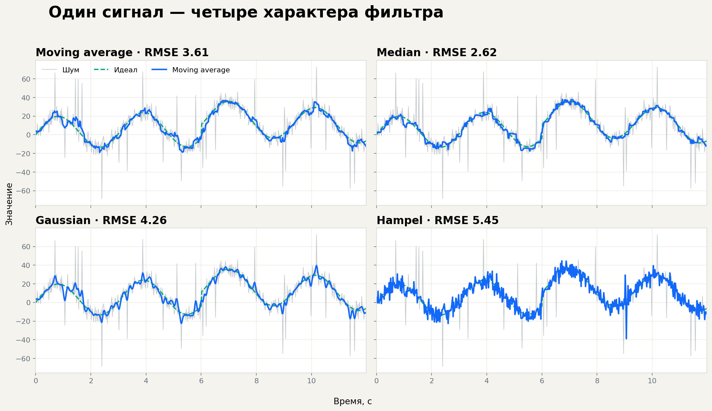
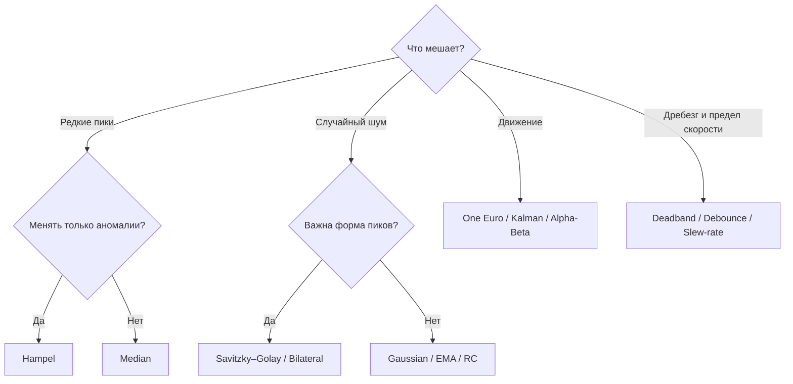
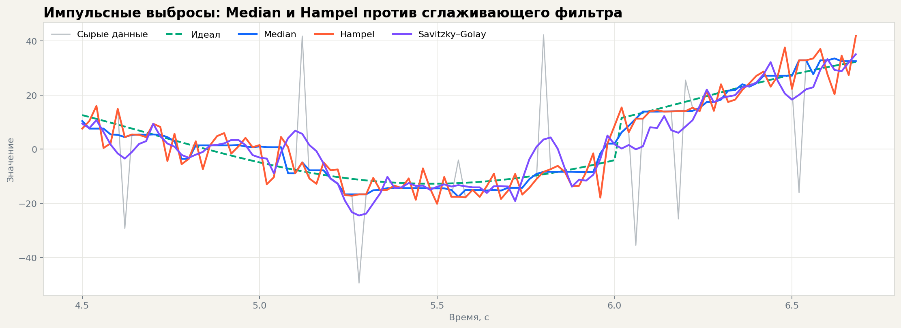
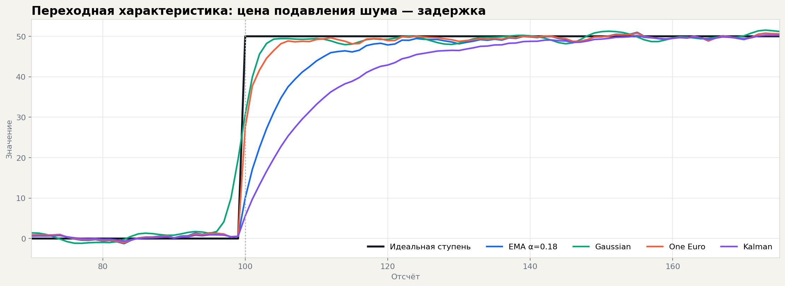
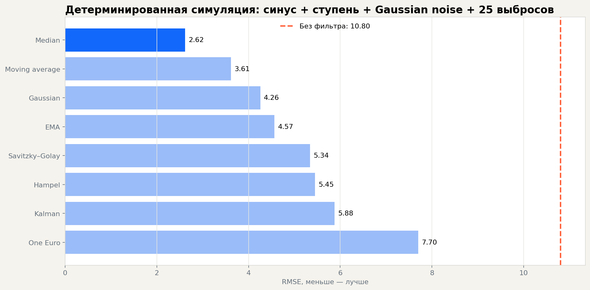

# Noise Filters — фильтрация сигналов на C#

[](https://github.com/Mika-dot/Noise-filters/actions/workflows/ci.yml)
[](https://raw.githack.com/Mika-dot/Noise-filters/feature/advanced-noise-filters/docs/index.html)
[](Filters/Filters/Filters.csproj)
[](#каталог-алгоритмов)

Учебная библиотека одномерных фильтров: от скользящего среднего до Hampel, Savitzky–Golay, One Euro и Калмана. Здесь можно не только взять готовый C#-код, но и **увидеть, что каждый алгоритм делает с одним и тем же сигналом**, сравнить RMSE, задержку и устойчивость к выбросам.

> Откройте **[интерактивную лабораторию](https://raw.githack.com/Mika-dot/Noise-filters/feature/advanced-noise-filters/docs/index.html)**: выберите форму сигнала, добавьте шум и выбросы, меняйте параметры двух фильтров одновременно. Исходник без внешних зависимостей лежит в [`docs/`](docs/).



## Что добавлено в расширенной ветке

- 25+ пригодных для вызова алгоритмов в пяти логических группах;
- единый API на `double[]` / `IReadOnlyList<double>` и проверка параметров;
- полноценный Savitzky–Golay через локальную полиномиальную аппроксимацию, а не обычное среднее;
- граничная обработка отражением вместо обрезания окна;
- интерактивная HTML/Canvas-лаборатория с 13 фильтрами и сравнением двух кривых;
- четыре воспроизводимых PNG-графика и CSV с результатами симуляции;
- консольный пример, метрики RMSE/MAE/noise reduction и 12 автономных тестов;
- GitHub Actions для сборки, тестов и публикации лаборатории на Pages;
- прежний класс `filtration` и фасад `AdvancedFilters` сохранены для совместимости.

## Быстрый старт

Подключите проект [`Filters/Filters/Filters.csproj`](Filters/Filters/Filters.csproj) как `ProjectReference` или соберите DLL:

```bash
dotnet build Filters/Filters/Filters.csproj -c Release
```

```csharp
using Filters;

double[] measurements = { 10, 11, 10, 58, 12, 11, 12, 13, 12 };

double[] smooth = SignalFilters.Gaussian(measurements, window: 7, sigma: 1.5);
double[] withoutSpikes = RobustFilters.Hampel(measurements, window: 7, threshold: 3.0);
double[] streaming = BasicFilters.ExponentialMovingAverage(measurements, alpha: 0.2);
double[] tracking = StateEstimationFilters.ScalarKalman(
    measurements, measurementNoise: 16, processNoise: 0.2);
```

Все новые методы возвращают массив той же длины, не меняют вход, корректно обрабатывают пустой массив, отклоняют `NaN`/`Infinity` и не требуют сторонних NuGet-пакетов.

## Как выбрать фильтр за минуту



| Задача | Начните с | Почему |
|---|---|---|
| Одиночные выбросы | `Hampel` | Оставляет нормальные точки без сглаживания |
| Импульсный шум высокой плотности | `Median` | Амплитуда выброса почти не влияет на медиану |
| Белый шум датчика | `Gaussian` или `EMA` | Простой и предсказуемый компромисс |
| Сохранить ширину/форму пика | `SavitzkyGolay` | Аппроксимирует локальный полином |
| Сохранить резкий фронт | `Bilateral` | Не смешивает сильно различающиеся уровни |
| Координаты мыши, жесты, трекер | `OneEuro` | Сила фильтра зависит от скорости |
| Есть оценка дисперсий | `ScalarKalman` | Балансирует модель и измерение по неопределённости |
| Дребезг дискретного состояния | `Debounce` | Принимает только устойчивое состояние |
| Мелкая вибрация вокруг уставки | `Deadband` | Игнорирует изменения внутри зоны |
| Нельзя менять величину слишком быстро | `SlewRateLimiter` | Ограничивает физически невозможный шаг |

## Каталог алгоритмов

### Базовые и статистические — `BasicFilters`

| Метод | Сложность | Онлайн | Назначение |
|---|---:|:---:|---|
| `MovingAverage` | O(n) | ✓ | Причинное скользящее среднее |
| `CenteredMovingAverage` | O(n·w) | — | Симметричное сглаживание без фазового сдвига |
| `WeightedMovingAverage` | O(n·w) | зависит | Произвольные веса окна |
| `TriangularMovingAverage` | O(n·w) | — | Больше веса центральным отсчётам |
| `ExponentialMovingAverage` | O(n) | ✓ | EMA, одна переменная состояния |
| `DoubleExponentialMovingAverage` | O(n) | ✓ | EMA с компенсацией части задержки |
| `HoltLinearTrend` | O(n) | ✓ | Уровень и линейный тренд |
| `Median` | O(n·w log w) | — | Импульсный шум |
| `Percentile` | O(n·w log w) | — | Нижняя/верхняя огибающая, квантили |
| `Mode` | O(n·w) | — | Дискретные или квантованные измерения |

### Робастные — `RobustFilters`

| Метод | Что делает | Когда применять |
|---|---|---|
| `Hampel` | Локальный median + MAD, заменяет только аномалию | Редкие сбои датчика |
| `MedianAbsoluteDeviationCleaner` | Глобальная робастная z-оценка | Очистка конечной выборки |
| `SigmaClip` | Итеративно ограничивает отклонение от среднего | Почти гауссовы данные |
| `TukeyFence` | Ограничивает значения границами IQR | Разведочный анализ |
| `TrimmedMean` | Отбрасывает хвосты локального окна | Смешанный шум |
| `WinsorizedMean` | Прижимает хвосты к квантилям | Нужна непрерывность результата |
| `AdaptiveMedian` | Увеличивает окно до надёжной медианы | Переменная плотность импульсов |

### Сигнальные и управляющие — `SignalFilters`

| Метод | Класс | Ключевой параметр |
|---|---|---|
| `Gaussian` | симметричный FIR | `sigma`, `window` |
| `SavitzkyGolay` | локальная полиномиальная регрессия | `polynomialOrder` |
| `Fir` | причинная свёртка | `coefficients` |
| `LowPassRc` | IIR НЧ первого порядка | `cutoffHz` |
| `HighPassRc` | IIR ВЧ первого порядка | `cutoffHz` |
| `Complementary` | слияние двух источников | `alpha` |
| `OneEuro` | адаптивный НЧ | `minCutoff`, `beta` |
| `Bilateral` | нелинейный edge-preserving | `spatialSigma`, `rangeSigma` |
| `Deadband` | зона нечувствительности | `width` |
| `SlewRateLimiter` | ограничитель скорости | `maxRise`, `maxFall` |
| `Debounce` | антидребезг | `stableSamples` |

### Оценка состояния — `StateEstimationFilters`

| Метод | Состояние | Сценарий |
|---|---|---|
| `ScalarKalman` | значение + дисперсия | Скалярный датчик с известным шумом |
| `AlphaBeta` | положение + скорость | Быстрый дешёвый трекер |

Подробные формулы, параметры и граничные случаи: **[`docs/ALGORITHMS.md`](docs/ALGORITHMS.md)**.

## Наглядное сравнение

### Пики и выбросы

Median непрерывно заменяет центр окна медианой. Hampel сначала спрашивает: «эта точка действительно аномальна?» — и только потом меняет её. Savitzky–Golay сохраняет форму гладкого сигнала, но сам по себе не является детектором выбросов.



### Переходный процесс

Чем сильнее подавление шума, тем чаще приходится платить задержкой. One Euro уменьшает эту цену: при быстром движении автоматически ослабляет сглаживание. Kalman раскрывается сильнее, когда состояние описано адекватной моделью; здесь показан намеренно простой скалярный вариант.



### Детерминированная симуляция

Сценарий: 600 отсчётов при 50 Гц, сумма двух синусов, ступень, гауссов шум σ=5.2 и 25 выбросов. Seed фиксирован (`20260824`), поэтому график воспроизводим. Это **не универсальный рейтинг**: победитель зависит от сигнала и настройки.



| Фильтр | RMSE | Снижение ошибки | Оценка задержки |
|---|---:|---:|---:|
| Median | 2.62 | 75.76% | 0 |
| Moving average | 3.61 | 66.54% | 1 |
| Gaussian | 4.26 | 60.59% | 1 |
| EMA | 4.57 | 57.73% | 6 |
| Savitzky–Golay | 5.34 | 50.57% | 1 |
| Hampel | 5.45 | 49.53% | 0 |
| Kalman | 5.88 | 45.61% | 10 |
| One Euro | 7.70 | 28.70% | 4 |

Исходные числа: [`benchmark.csv`](docs/charts/benchmark.csv). Пересборка изображений:

```bash
python tools/generate_charts.py
```

<details>
<summary><strong>Дополнительный стенд: 10 исторических и расширенных фильтров</strong></summary>

В репозитории сохранён второй независимый сценарий на 720 отсчётов: периодические компоненты, дрейф, ступень, Gaussian noise и девять заранее заданных импульсов. Он сравнивает также старые `filtration.SimpleKalman` и `filtration.AlphaBetaFilter`, а CSV содержит RMSE, MAE, улучшение SNR и лаг.


Отдельный график показывает время Python-реализаций на 12 000 отсчётов. Это скорость генератора документации, **не C# benchmark**.


Пересборка: `python tools/generate_benchmarks.py`. Исходные таблицы находятся в [`docs/assets/benchmarks/`](docs/assets/benchmarks/).

</details>

## Интерактивная лаборатория

Лаборатория работает целиком в браузере и не передаёт данные наружу:

- 6 форм сигнала;
- регулируемые гауссов шум и вероятность выбросов;
- 13 интерактивных фильтров;
- одновременное сравнение двух алгоритмов;
- окно и основной параметр каждого фильтра;
- RMSE, процент подавления ошибки, число исправленных выбросов и оценка лага;
- адаптивный Canvas-график для desktop и телефона.

```bash
python -m http.server 8080 --directory docs
```

Откройте `http://localhost:8080`. Публичная версия уже доступна через raw.githack; workflow [`pages.yml`](.github/workflows/pages.yml) также готов для ручного запуска после одноразового включения GitHub Pages в настройках репозитория.

## Проверка

```bash
dotnet build Filters/Filters/Filters.csproj -c Release
dotnet run --project Tests/NoiseFilters.Tests/NoiseFilters.Tests.csproj -c Release
dotnet run --project Examples/ConsoleDemo/ConsoleDemo.csproj -c Release
```

Тестовый runner не зависит от xUnit/NUnit и проверяет базовую математику, пустой вход, валидацию, удаление выброса, сохранение квадратичного полинома Savitzky–Golay и конечность оценки Калмана.

## Структура

```text
Filters/Filters/
├── filtration.cs                 старый API, сохранён
├── BasicFilters.cs               средние, EMA, медиана, квантили
├── RobustFilters.cs              Hampel, MAD, sigma/IQR, robust mean
├── SignalFilters.cs              Gaussian, SG, FIR/IIR, One Euro, control
├── StateEstimationFilters.cs     Kalman и alpha-beta
├── FilterMetrics.cs              RMSE, MAE, noise reduction
└── AdvancedFilters.cs            совместимый фасад
Examples/ConsoleDemo/              сравнение фильтров в консоли
Tests/NoiseFilters.Tests/          автономные тесты
docs/                              интерактивная лаборатория и графики
tools/generate_charts.py           воспроизводимая симуляция
```

## Важное ограничение

Фильтр не бывает «лучшим вообще». Параметры нужно связывать с частотой дискретизации, спектром полезного сигнала, физической скоростью процесса и ценой задержки. Для safety-critical систем эта библиотека — учебная отправная точка, а не замена верифицированному DSP/контроллеру.
