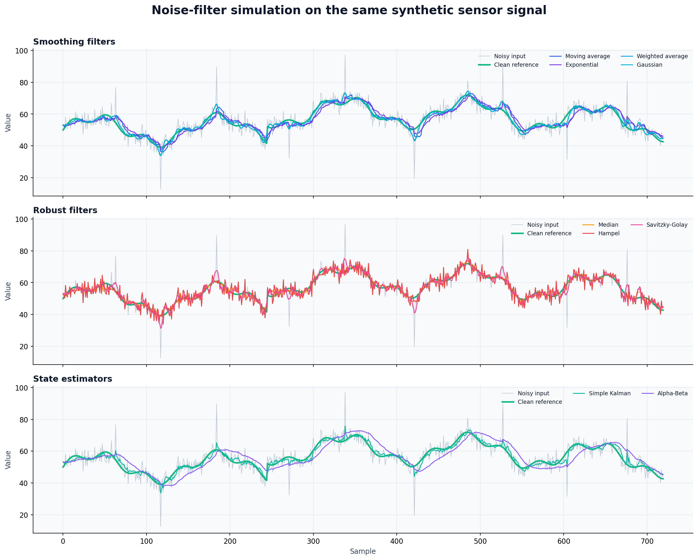
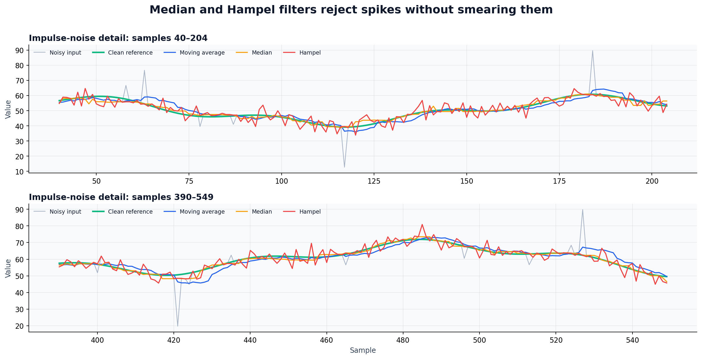
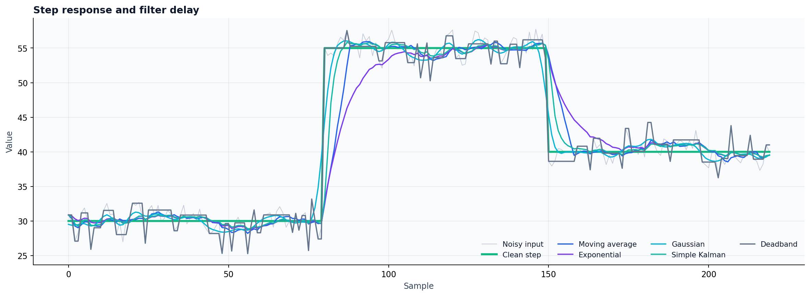
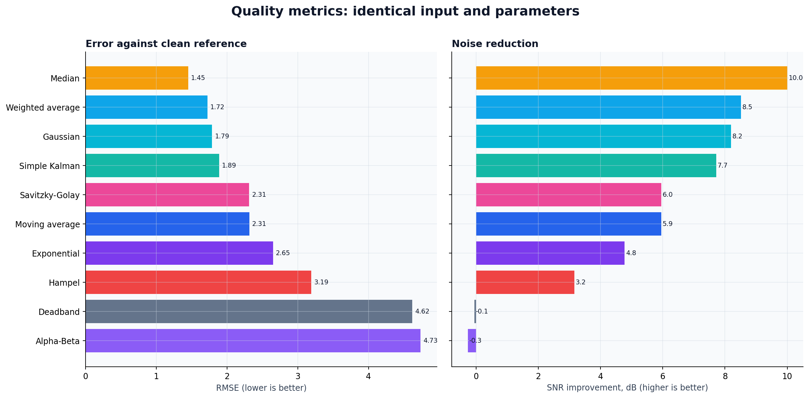
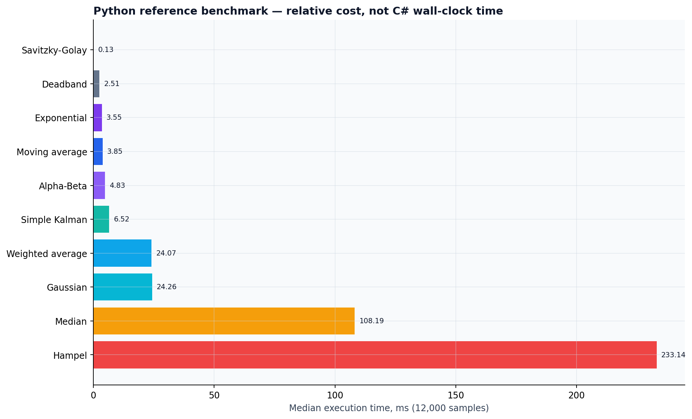

# Noise-filters

> A visual, reproducible handbook of digital filters for sensor measurements,
> industrial telemetry and embedded systems.

[Русская версия](README_ru.md) · [Interactive playground](docs/playground/index.html) · [Raw benchmark data](docs/assets/benchmarks/quality-metrics.csv)

The repository contains the original C# filters, an extended filter set and a
deterministic simulation that shows what every algorithm actually does to the
same signal.

## Real simulation

The input is not a hand-drawn diagram. It is a 720-sample synthetic sensor
signal with two periodic components, a step, drift, Gaussian noise
(`σ = 3.2`) and nine positive/negative impulse outliers. Random seed:
`20260824`.



### What happens around outliers

The same samples are enlarged below. A moving average spreads a spike across
the window, while Median and Hampel treat it as an abnormal measurement.



### Step response and delay

Strong smoothing is never free: causal filters reduce noise but respond later
to a real process change. Deadband responds immediately only after its
threshold is crossed.



## Measured quality

Metrics are calculated after a 20-sample warm-up against the known clean
reference. Lower RMSE/MAE is better; higher SNR improvement is better. The
winner depends on the noise model—this mixed test deliberately favors robust
filters because it includes impulse outliers.



| Filter | RMSE | MAE | SNR improvement | Best-fit lag |
|---|---:|---:|---:|---:|
| **Median** | **1.45** | **1.13** | **+10.00 dB** | 0 samples |
| Weighted average | 1.72 | 1.23 | +8.51 dB | 0 samples |
| Gaussian | 1.79 | 1.27 | +8.19 dB | 0 samples |
| Simple Kalman | 1.89 | 1.45 | +7.72 dB | 3 samples |
| Savitzky-Golay | 2.31 | 1.67 | +5.95 dB | 0 samples |
| Moving average | 2.31 | 1.79 | +5.95 dB | 4 samples |
| Exponential | 2.65 | 2.13 | +4.77 dB | 6 samples |
| Hampel | 3.19 | 2.54 | +3.16 dB | 0 samples |
| Deadband | 4.62 | 3.07 | −0.05 dB | 0 samples |
| Alpha-Beta | 4.73 | 4.01 | −0.27 dB | 13 samples |

The Alpha-Beta and Deadband results are not bugs: both are specialized tools,
not universal denoisers. Alpha-Beta requires a motion/process model tuned to
the data. Deadband suppresses small control chatter, but it is not designed to
reconstruct a clean analogue waveform.

## Which filter should I choose?

| Problem | Start with | Why | Main trade-off |
|---|---|---|---|
| Rare spikes / broken samples | Hampel or Median | Robust to outliers | Median can flatten narrow features |
| White high-frequency noise | Gaussian or Weighted Average | Strong smoothing with symmetric weights | Non-causal window adds delay in streaming |
| Low-memory live sensor | Exponential Average | One state value, constant work | Phase lag |
| Known dynamic system | Kalman | Prediction plus measurement correction | Must tune the model and noise |
| Preserve peaks and curvature | Savitzky-Golay | Local polynomial fit | Sensitive to large outliers |
| Switch/control chatter | Deadband | Ignores insignificant changes | Quantized, staircase-like output |
| Position and velocity tracking | Alpha-Beta | Very small state estimator | Model mismatch causes lag/error |

## Implemented algorithms

| Family | Algorithms | Cost per sample | Memory |
|---|---|---:|---:|
| Basic smoothing | Average, Stretched Selection, Running Average | `O(w)` / `O(1)` optimized | `O(w)` |
| Recursive | Exponential Average, Adaptive Factor | `O(1)` | `O(1)` |
| Robust | Median, Hampel | `O(w log w)` | `O(w)` |
| Weighted convolution | Weighted Average, Gaussian | `O(w)` | `O(w)` |
| Polynomial | Least Squares, Savitzky-Golay | `O(w · p)` after coefficients | `O(w + p²)` |
| State estimators | Simple Kalman, Alpha-Beta | `O(1)` | `O(1)` |
| Control | Deadband | `O(1)` | `O(1)` |

`w` is the window length and `p` is the polynomial order.

## Reproduce every chart

The chart generator contains reference implementations that mirror the C#
equations. It writes both PNG figures and source CSV files.

```bash
python3 -m pip install numpy matplotlib
python3 tools/generate_benchmarks.py
```

Generated files are written to `docs/assets/benchmarks/`. Because the random
seed, signal, outlier positions and parameters are fixed, repeated runs produce
the same quality results.

### Reference-script runtime



This plot measures the Python chart generator on 12,000 samples (median of five
runs). It is useful for understanding the cost of regenerating the experiment,
but it is **not a C# performance benchmark**: NumPy vectorization and Python
loops affect the absolute values. The raw timings are in
[`runtime-reference.csv`](docs/assets/benchmarks/runtime-reference.csv).

## C# usage

```csharp
using Filters;

double[] cleaned = AdvancedFilters.GaussianFilter(samples, size: 9, sigma: 2.0);
double[] robust = AdvancedFilters.HampelFilter(samples, window: 4, threshold: 3.0);
double[] shaped = AdvancedFilters.SavitzkyGolay(samples, window: 9, polynomialOrder: 3);
double[] stable = AdvancedFilters.Deadband(samples, limit: 2.0);
```

The original integer-based algorithms remain available through `filtration`:

```csharp
double[] moving = filtration.RunningAverage(integerSamples);
double[] kalman = filtration.SimpleKalman(integerSamples);
double[] tracked = filtration.AlphaBetaFilter(integerSamples);
```

## Project layout

```text
Filters/Filters/filtration.cs          original algorithms
Filters/Filters/AdvancedFilters.cs     extended filter set
tools/generate_benchmarks.py           deterministic simulation
docs/assets/benchmarks/                generated charts and CSV metrics
docs/playground/index.html             interactive browser demo
Filter in charts/                      historical charts
```

## Notes

- Windowed symmetric filters use future samples and are best suited to offline
  processing. For live streams, use a trailing window or accept a delay of
  `window / 2` samples.
- Filter parameters must be tuned to the sensor sampling rate and the physics
  of the measured process.
- The benchmark is an educational comparison, not proof that one filter is
  universally superior.

## License

No license file is currently included. Add one before distributing the library
as a reusable package.
