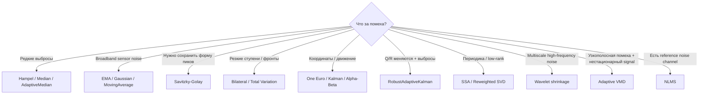

# Noise Filters — исследовательская библиотека фильтрации 1D-сигналов на C#

[](https://github.com/Mika-dot/Noise-filters)
[](https://github.com/Mika-dot/Noise-filters/blob/feature/advanced-noise-filters/Filters/Filters/Filters.csproj)
[](https://github.com/Mika-dot/Noise-filters/tree/feature/advanced-noise-filters)
[](https://github.com/Mika-dot/Noise-filters/tree/feature/recent-denoising-2026)
[](https://github.com/Mika-dot/Noise-filters/tree/feature/adaptive-decomposition-2026)

Репозиторий превратился из набора простых фильтров в последовательное исследование методов очистки одномерных измерительных сигналов: **moving average → robust statistics → DSP/state estimation → wavelet/SSA/SVD → adaptive Kalman → VMD + автоматический выбор мод**.

`main` намеренно используется как **витрина всех веток**. Новые исследования остаются отдельными ветками, чтобы можно было видеть эволюцию алгоритмов, сравнивать реализации и не смешивать экспериментальный код с историческим baseline.

> Benchmark-цифры из разных разделов получены на разных детерминированных сценариях. Их нельзя складывать в один глобальный рейтинг.

## Ветки и поколения

| Ветка | Поколение | Основная идея | Что добавлено |
|---|---|---|---|
| [`main`](https://github.com/Mika-dot/Noise-filters/tree/main) | v1 / baseline | Простые фильтры и первые эксперименты | Average, running average, EMA, median, LSQ, simple Kalman, α–β |
| [`feature/advanced-noise-filters`](https://github.com/Mika-dot/Noise-filters/tree/feature/advanced-noise-filters) | v2 / practical DSP | Нормальная библиотека и единый API | 30 методов, robust filters, SG, One Euro, bilateral, proper scalar Kalman, tests, CI, lab |
| [`feature/recent-denoising-2026`](https://github.com/Mika-dot/Noise-filters/tree/feature/recent-denoising-2026) | v3 / modern denoising | Batch/low-rank/multiscale методы | wavelet shrinkage, SSA, reweighted SVD, TV, robust adaptive Kalman |
| [`feature/adaptive-decomposition-2026`](https://github.com/Mika-dot/Noise-filters/tree/feature/adaptive-decomposition-2026) | v4 / adaptive decomposition | Автоматическая декомпозиция нестационарных сигналов | VMD, auto `K/α`, permutation entropy, structure-aware IMF selection, NLMS |

## Быстрый выбор



| Задача | Начать с | Почему | Ограничение |
|---|---|---|---|
| Одиночные spikes | `Hampel` | Меняет только аномальные точки | Window + threshold |
| Плотный impulse noise | `Median` | Амплитуда выброса почти не влияет | Может съесть детали |
| Белый шум датчика | `EMA` / `Gaussian` | Быстро и предсказуемо | Lag / blur |
| Сохранить smooth peak | `SavitzkyGolay` | Local polynomial | Не любит сильные spikes |
| Сохранить step | `Bilateral` / `TV` | Edge-preserving | Дороже/нелинейно |
| Position / pose / cursor | `OneEuro` | Фильтрация зависит от скорости | Нужна настройка cutoff/beta |
| Известна noise model | `ScalarKalman` | Интерпретируемые Q/R | Модель должна быть адекватна |
| Noise covariance плавает | `RobustAdaptiveKalman` | Online adaptation + robust innovation | Scalar-state baseline |
| Quasi-periodic batch signal | `SSA` | Low-rank trajectory structure | Batch, дорогая линейная алгебра |
| Мягкое SVD-denoising | `ReweightedSvdDenoise` | Нет жёсткого rank cutoff | Batch |
| Narrow-band interference | `AdaptiveVmdEntropyCorrelationDenoise` | Разделяет signal/noise по модам | Сейчас reference DFT backend |
| Есть отдельный датчик помехи | `NormalizedLmsNoiseCancel` | Адаптивно вычитает correlated noise | Нужен хороший reference channel |

---

# 1. `main` — исторический baseline

Исходная реализация: [`Filters/Filters/filtration.cs`](Filters/Filters/filtration.cs).

| Метод | Тип | Online | Особенность |
|---|---|:---:|---|
| `NoiseCalculation` | heuristic diagnostics | ✓ | Оценка шума/выбросов |
| `Average` | box average | — | Усреднение окна |
| `StretchedSelection` | block average | ✓ | Sample-and-hold после блока |
| `RunningAverage` | moving average | ✓ | Ring-buffer |
| `ExponentialRunningAverage` | EMA / IIR | ✓ | Минимум памяти |
| `AdaptiveFactor` | adaptive EMA | ✓ | Коэффициент зависит от ошибки |
| `MedianFilter` | median | зависит | Impulse-noise robustness |
| `LeastSquareMethod2` | linear LSQ | — | Linear fit + RMS |
| `LeastSquareMethod3` | quadratic LSQ | — | Quadratic fit + RMS |
| `SimpleKalman` | lightweight tracker | ✓ | Историческая Kalman-like версия |
| `AlphaBetaFilter` | α–β | ✓ | Position + velocity |

### Старые графики

<table>
<tr>
<td></td>
<td></td>
</tr>
<tr>
<td></td>
<td></td>
</tr>
</table>

Все исторические изображения: [`Filter in charts/`](https://github.com/Mika-dot/Noise-filters/tree/main/Filter%20in%20charts).

---

# 2. `feature/advanced-noise-filters` — practical DSP library

Ветка: [`feature/advanced-noise-filters`](https://github.com/Mika-dot/Noise-filters/tree/feature/advanced-noise-filters)

Здесь появился нормальный API `double[] / IReadOnlyList<double>`, validation, mirror boundaries, `.NET Standard 2.0`, dependency-free tests, CI, console example и interactive lab.

## Basic / statistical

`MovingAverage`, `CenteredMovingAverage`, `WeightedMovingAverage`, `TriangularMovingAverage`, `ExponentialMovingAverage`, `DoubleExponentialMovingAverage`, `HoltLinearTrend`, `Median`, `Percentile`, `Mode`.

## Robust

`Hampel`, `MedianAbsoluteDeviationCleaner`, `SigmaClip`, `TukeyFence`, `TrimmedMean`, `WinsorizedMean`, `AdaptiveMedian`.

## DSP / control

`Gaussian`, `SavitzkyGolay`, `Fir`, `LowPassRc`, `HighPassRc`, `Complementary`, `OneEuro`, `Bilateral`, `Deadband`, `SlewRateLimiter`, `Debounce`.

## State estimation

`ScalarKalman`, `AlphaBeta`.

### Advanced benchmark

Сценарий: 600 samples @ 50 Hz, periodic components + step + Gaussian noise `σ=5.2` + 25 outliers, seed `20260824`.

| Filter | RMSE | Error reduction | Lag estimate |
|---|---:|---:|---:|
| Median | **2.62** | 75.76% | 0 |
| Moving average | 3.61 | 66.54% | 1 |
| Gaussian | 4.26 | 60.59% | 1 |
| EMA | 4.57 | 57.73% | 6 |
| Savitzky–Golay | 5.34 | 50.57% | 1 |
| Hampel | 5.45 | 49.53% | 0 |
| Kalman | 5.88 | 45.61% | 10 |
| One Euro | 7.70 | 28.70% | 4 |


- [Interactive lab](https://raw.githack.com/Mika-dot/Noise-filters/feature/advanced-noise-filters/docs/index.html)
- [Algorithm notes](https://github.com/Mika-dot/Noise-filters/blob/feature/advanced-noise-filters/docs/ALGORITHMS.md)
- [Benchmark CSV](https://github.com/Mika-dot/Noise-filters/blob/feature/advanced-noise-filters/docs/charts/benchmark.csv)

---

# 3. `feature/recent-denoising-2026` — wavelet / low-rank / adaptive estimation

Ветка: [`feature/recent-denoising-2026`](https://github.com/Mika-dot/Noise-filters/tree/feature/recent-denoising-2026)

Основной файл: [`ModernDenoisingFilters.cs`](https://github.com/Mika-dot/Noise-filters/blob/feature/recent-denoising-2026/Filters/Filters/ModernDenoisingFilters.cs).

| Method | Family | Online | Идея |
|---|---|:---:|---|
| `WaveletHaarShrinkage` | wavelet | — | Haar DWT + MAD + universal threshold |
| `SingularSpectrumAnalysis` | SSA | — | Hankel embedding + truncated eigenspace |
| `ReweightedSvdDenoise` | low-rank | — | Adaptive singular-value shrinkage |
| `TotalVariationDenoise` | variational | — | ROF/TV, сохраняет steps |
| `RobustAdaptiveKalman` | state estimation | ✓ | Online `R` adaptation + Huber innovation |

### Recent benchmark

| Method | RMSE | RMSE around spikes |
|---|---:|---:|
| **Reweighted SVD** | **0.8358** | 1.5169 |
| SSA rank 6 | 0.8523 | **1.1597** |
| Savitzky–Golay | 0.9850 | 1.7747 |
| Wavelet Haar | 0.9982 | 1.7230 |
| Robust adaptive Kalman | 1.2776 | 1.2584 |
| TV | 1.4426 | 3.8380 |
| Raw | 2.2699 | 5.2868 |


- [Research notes 2024–2026](https://github.com/Mika-dot/Noise-filters/blob/feature/recent-denoising-2026/docs/RESEARCH_2026.md)
- [Benchmark CSV](https://github.com/Mika-dot/Noise-filters/blob/feature/recent-denoising-2026/docs/charts/recent_benchmark.csv)

---

# 4. `feature/adaptive-decomposition-2026` — adaptive VMD / entropy / NLMS

Ветка: **[`feature/adaptive-decomposition-2026`](https://github.com/Mika-dot/Noise-filters/tree/feature/adaptive-decomposition-2026)**

Это следующий слой исследования для **non-linear / non-stationary signals**, где фиксированное окно уже плохо описывает структуру данных.

## Новые компоненты

| API | Что делает | Ключевая особенность |
|---|---|---|
| `VariationalModeDecomposition` | Разлагает сигнал на band-limited modes | Возвращает modes + center frequencies + convergence diagnostics |
| `AdaptiveVmdWaveletDenoise` | Автоматически ищет `K` и `α` | Score = reconstruction + entropy + mode overlap + complexity |
| `AdaptiveVmdEntropyCorrelationDenoise` | Structure-aware reconstruction | `|corr| × (1 - permutation entropy)` для каждого IMF |
| `PermutationEntropy` | Оценка сложности mode | Нормированная ordinal-pattern entropy `[0,1]` |
| `NormalizedLmsNoiseCancel` | Adaptive noise cancellation | Использует отдельный correlated reference-noise channel |

C# VMD сейчас специально использует **direct DFT/IDFT**: реализация читаемая и dependency-free, но это reference implementation, а не high-throughput FFT backend.

## Двухрежимный benchmark

Чтобы не подобрать один удобный dataset, используются два режима с seed `20260905`.

### A. Structured / narrow-band interference

Полезный сигнал: low-frequency component + chirp + step + short transients. Помехи: white noise + 31 Hz + 42 Hz + редкие impulses.

| Method | RMSE | SNR, dB | Correlation |
|---|---:|---:|---:|
| Raw | 0.7629 | 2.95 | 0.8104 |
| Moving average | 0.4105 | 8.33 | 0.9207 |
| Median | 0.4813 | 6.95 | 0.8907 |
| Savitzky–Golay | 0.2639 | 12.17 | 0.9679 |
| Reweighted SVD | 0.7065 | 3.62 | 0.8236 |
| **Adaptive VMD structure** | **0.2242** | **13.59** | **0.9778** |

Auto-search выбрал `K=4`, `α=250`.

### B. Broadband + impulsive noise

| Method | RMSE | SNR, dB | Correlation |
|---|---:|---:|---:|
| Raw | 1.1901 | 0.41 | 0.7178 |
| **Moving average** | **0.4456** | **8.94** | **0.9319** |
| Median | 0.4850 | 8.20 | 0.9214 |
| Savitzky–Golay | 0.5205 | 7.59 | 0.9176 |
| Reweighted SVD | 0.6374 | 5.83 | 0.8724 |
| Adaptive VMD structure | 0.6087 | 6.23 | 0.8949 |

То есть adaptive VMD **не является универсально лучшим фильтром**: он особенно полезен при структурированных/узкополосных помехах, а для broadband noise локальные фильтры могут быть проще и точнее.


- [Полное описание исследования](https://github.com/Mika-dot/Noise-filters/blob/feature/adaptive-decomposition-2026/docs/ADAPTIVE_DECOMPOSITION_2026.md)
- [Benchmark CSV](https://github.com/Mika-dot/Noise-filters/blob/feature/adaptive-decomposition-2026/docs/charts/adaptive_vmd_benchmark.csv)
- [Benchmark generator](https://github.com/Mika-dot/Noise-filters/blob/feature/adaptive-decomposition-2026/tools/generate_adaptive_vmd_benchmark.py)

## Свежая исследовательская база

Новая ветка ориентируется на архитектурные идеи современных работ, но реализации написаны независимо и не заявлены как verbatim reproduction:

- Sensors 2026 — Parameter-Adaptive VMD + Wavelet Thresholding, DOI `10.3390/s26133974`;
- Signal Processing 2026 — Adaptive Successive VMD, DOI `10.1016/j.sigpro.2025.110368`;
- Sensors 2026 — ICFO–SVMD + improved wavelet thresholding, DOI `10.3390/s26020750`;
- Structural Durability & Health Monitoring 2025 — adaptive VMD + WT, DOI `10.32604/sdhm.2025.061805`;
- Remote Sensing 2025 — adaptive VMD + MSPCA, DOI `10.3390/rs17030525`;
- Electronics 2025 — VMD + NLMS, DOI `10.3390/electronics14244914`.

---

# API / сборка

Практическая библиотека и исследовательские ветки сохраняют `.NET Standard 2.0` для основного проекта.

```bash
dotnet build Filters/Filters/Filters.csproj -c Release
```

Пример advanced API:

```csharp
using Filters;

double[] measurements = { 10, 11, 10, 58, 12, 11, 12, 13 };

double[] robust = RobustFilters.Hampel(measurements, window: 7, threshold: 3.0);
double[] smooth = SignalFilters.SavitzkyGolay(measurements, window: 7, polynomialOrder: 3);
double[] tracking = ModernDenoisingFilters.RobustAdaptiveKalman(measurements);
```

Adaptive-decomposition branch:

```csharp
AdaptiveVmdResult result = StructureAwareVmdFilters.AdaptiveVmdEntropyCorrelationDenoise(
    measurements,
    maxModes: 6);

double[] filtered = result.Signal;

for (int k = 0; k < result.ModeCount; k++)
{
    Console.WriteLine($"mode={k} " +
        $"f={result.Decomposition.CenterFrequencies[k]:F4} " +
        $"PE={result.PermutationEntropies[k]:F3} " +
        $"corr={result.Correlations[k]:F3}");
}
```

# Тестирование и reproducibility

В новых ветках используются:

- GitHub Actions;
- dependency-free C# tests;
- отдельный adaptive-VMD smoke test;
- Python reference simulations;
- фиксированные random seeds;
- CSV рядом с графиками;
- generators для воспроизведения benchmark assets.

# Roadmap

Следующие логичные шаги исследования:

1. заменить reference DFT в VMD на FFT backend без изменения public API;
2. mirror extension и boundary-artifact metrics;
3. Successive VMD / SVMD;
4. multiscale permutation entropy;
5. automatic `tau` / stopping criteria;
6. explicit mode-mixing detection и mode merge/split;
7. VMD → NLMS cascade для реального reference-noise channel;
8. multichannel PCA/MSSA branch;
9. BenchmarkDotNet для C# throughput/allocation;
10. реальные datasets: IMU, bearing/gear vibration, ECG/PPG, acoustic, industrial sensors;
11. Pareto chart `quality ↔ latency ↔ memory` вместо рейтинга только по RMSE.

## Главное правило репозитория

**Нет универсально лучшего noise filter.** Нужный алгоритм определяется типом шума, структурой полезного сигнала, допустимой задержкой, доступностью модели процесса и вычислительным бюджетом. Поэтому ветки сохраняют не только «лучшие» результаты, но и сценарии, где новый метод проигрывает более простому.
