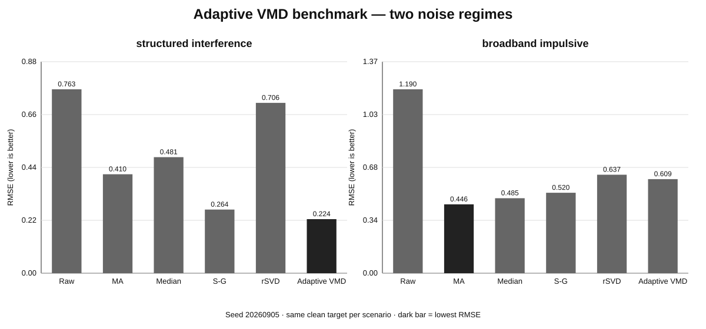

# Noise Filters — Adaptive Decomposition 2026

[](https://github.com/Mika-dot/Noise-filters/actions/workflows/ci.yml)
[](Filters/Filters/Filters.csproj)
[](docs/ADAPTIVE_DECOMPOSITION_2026.md)
[](https://github.com/Mika-dot/Noise-filters/tree/feature/recent-denoising-2026)

Эта ветка продолжает исследование `feature/recent-denoising-2026` в сторону **адаптивной декомпозиции нестационарных сигналов**. Вместо ещё одного фиксированного low-pass здесь сигнал сначала разбивается на моды, затем параметры декомпозиции и полезность каждой моды оцениваются автоматически.

Главная идея:

```text
raw signal
   │
   ├─► search K, α
   │      │
   │      └─ reconstruction error
   │         + permutation entropy
   │         + inter-mode overlap
   │         + complexity penalty
   │
   └─► VMD ─► IMF₀ ... IMFₖ
               │
               ├─ correlation with input
               ├─ permutation entropy
               └─ structure score
                    │
                    ├─ keep
                    ├─ wavelet refine
                    └─ reject
                         │
                         ▼
                    reconstruction
```

> VMD в этой ветке — **dependency-free research/reference implementation**. Для прозрачности математики используется direct DFT/IDFT на `System.Numerics.Complex`. Это не утверждение, что O(N²) DFT должен использоваться в production: следующий технический этап — FFT backend без изменения public API.

## Что нового

| API | Назначение |
|---|---|
| `VariationalModeDecomposition` | VMD + modes + center frequencies + convergence diagnostics |
| `AdaptiveVmdWaveletDenoise` | Детерминированный auto-search `K` и `α`, затем selective wavelet refinement |
| `AdaptiveVmdEntropyCorrelationDenoise` | Preferred structure-aware reconstruction по entropy + correlation |
| `PermutationEntropy` | Нормированная ordinal-pattern complexity `[0,1]` |
| `NormalizedLmsNoiseCancel` | Adaptive noise cancellation при наличии reference-noise channel |
| `VmdResult` | Modes, center frequencies, iterations, relative change, reconstruction RMSE |
| `AdaptiveVmdResult` | Selected parameters + entropy/correlation/keep/refine diagnostics |

Все предыдущие поколения фильтров также доступны в этой ветке: moving averages, Hampel, Savitzky–Golay, One Euro, bilateral, Kalman, wavelet shrinkage, SSA, reweighted SVD, TV и robust adaptive Kalman.

## Быстрый старт

```bash
dotnet build Filters/Filters/Filters.csproj -c Release
```

### Structure-aware adaptive VMD

```csharp
using Filters;

double[] samples = GetMeasurements();

AdaptiveVmdResult result =
    StructureAwareVmdFilters.AdaptiveVmdEntropyCorrelationDenoise(
        samples,
        maxModes: 6);

double[] filtered = result.Signal;

Console.WriteLine($"K={result.ModeCount}, alpha={result.Alpha}");

for (int k = 0; k < result.ModeCount; k++)
{
    Console.WriteLine(
        $"mode {k}: " +
        $"f={result.Decomposition.CenterFrequencies[k]:F4}, " +
        $"PE={result.PermutationEntropies[k]:F3}, " +
        $"corr={result.Correlations[k]:F3}, " +
        $"keep={result.Retained[k]}, " +
        $"wavelet={result.WaveletRefined[k]}");
}
```

### Чистая VMD-декомпозиция

```csharp
VmdResult decomposition =
    AdaptiveDecompositionFilters.VariationalModeDecomposition(
        samples,
        modes: 4,
        alpha: 1000,
        tau: 0.1);

double[][] modes = decomposition.Modes;
double[] centers = decomposition.CenterFrequencies;
```

### NLMS с reference-noise channel

```csharp
double[] filtered = AdaptiveDecompositionFilters.NormalizedLmsNoiseCancel(
    primarySignal,
    referenceNoise,
    taps: 16,
    stepSize: 0.5);
```

## Как выбирается VMD-модель

Для каждого кандидата `(K, α)` считается детерминированный score:

```text
score =
    2.5  × normalized reconstruction error
  + 0.35 × mean permutation entropy
  + 0.65 × mean |inter-mode correlation|
  + 0.025 × K
```

Это не «математически единственно правильная» функция. Это прозрачный reproducible baseline вместо скрытого метаэвристического optimizer-а, который сам добавляет stochastic variability.

После выбора модели preferred pipeline оценивает структуру каждого IMF:

```text
structure_score = |corr(IMF, input)| × (1 − permutation_entropy(IMF))
```

Высокая корреляция сама по себе недостаточна: сильная узкополосная помеха тоже может хорошо коррелировать с исходным сигналом. Низкая entropy сама по себе тоже недостаточна. Их совместное использование даёт дешёвый multi-criteria baseline.

## Двухрежимный benchmark

Один synthetic dataset слишком легко подогнать под новый метод, поэтому тест разделён на два режима. Seed: `20260905`.

### A — structured / narrow-band interference

Полезный сигнал содержит low-frequency component, chirp, step и короткие transients. Помехи: white noise + 31 Hz + 42 Hz + несколько impulses.

| Method | RMSE ↓ | SNR ↑ | Correlation ↑ |
|---|---:|---:|---:|
| Raw | 0.7629 | 2.95 dB | 0.8104 |
| Moving average | 0.4105 | 8.33 dB | 0.9207 |
| Median | 0.4813 | 6.95 dB | 0.8907 |
| Savitzky–Golay | 0.2639 | 12.17 dB | 0.9679 |
| Reweighted SVD | 0.7065 | 3.62 dB | 0.8236 |
| **Adaptive VMD structure** | **0.2242** | **13.59 dB** | **0.9778** |

Auto-search выбрал `K=4`, `α=250`.

### B — broadband + impulsive noise

| Method | RMSE ↓ | SNR ↑ | Correlation ↑ |
|---|---:|---:|---:|
| Raw | 1.1901 | 0.41 dB | 0.7178 |
| **Moving average** | **0.4456** | **8.94 dB** | **0.9319** |
| Median | 0.4850 | 8.20 dB | 0.9214 |
| Savitzky–Golay | 0.5205 | 7.59 dB | 0.9176 |
| Reweighted SVD | 0.6374 | 5.83 dB | 0.8724 |
| Adaptive VMD structure | 0.6087 | 6.23 dB | 0.8949 |

Здесь простой moving average выигрывает. Это оставлено намеренно: **Adaptive VMD — специализированный инструмент для структурированных/модальных помех, а не универсальная замена простым фильтрам.**



Данные: [`docs/charts/adaptive_vmd_benchmark.csv`](docs/charts/adaptive_vmd_benchmark.csv).

Воспроизведение:

```bash
python tools/generate_adaptive_vmd_benchmark.py
```

## Как выбирать метод

| Ситуация | Метод |
|---|---|
| Narrow-band interference + non-stationary useful signal | `AdaptiveVmdEntropyCorrelationDenoise` |
| Нужно исследовать модальную структуру | `VariationalModeDecomposition` |
| Есть отдельный physical/reference noise channel | `NormalizedLmsNoiseCancel` |
| Одиночные выбросы | `Hampel` / `Median` |
| Broadband sensor noise | `EMA` / `Gaussian` / moving average |
| Smooth peaks / derivatives | `SavitzkyGolay` |
| Quasi-periodic low-rank batch signal | `SSA` / `ReweightedSvdDenoise` |
| Sharp piecewise-constant transitions | `TotalVariationDenoise` |
| Online changing covariance | `RobustAdaptiveKalman` |

## CI / tests

GitHub Actions проверяет:

```text
.NET library build
    ↓
21 dependency-free C# tests
    ↓
adaptive VMD smoke test
    ↓
console example
    ↓
Python reference tests
    ↓
chart-generator syntax validation
    ↓
full adaptive-VMD benchmark execution
```

Smoke test дополнительно проверяет:

- допустимое выбранное `K`;
- выбор `α` из candidate grid;
- center frequencies в `[0, 0.5]` cycles/sample;
- размер diagnostics arrays;
- отсутствие `NaN`/`Infinity`;
- наличие хотя бы одной retained mode.

## Исследовательская база 2025–2026

Архитектура ветки вдохновлена современным направлением **adaptive decomposition → mode classification → selective denoising → reconstruction**:

- Parameter-Adaptive VMD + Wavelet Thresholding, Sensors 2026 — DOI `10.3390/s26133974`;
- Adaptive Successive VMD, Signal Processing 2026 — DOI `10.1016/j.sigpro.2025.110368`;
- ICFO–SVMD + Improved Wavelet Thresholding, Sensors 2026 — DOI `10.3390/s26020750`;
- Adaptive VMD + WT for gear monitoring, 2025 — DOI `10.32604/sdhm.2025.061805`;
- Adaptive VMD + MSPCA, Remote Sensing 2025 — DOI `10.3390/rs17030525`;
- VMD + NLMS joint optimization, Electronics 2025 — DOI `10.3390/electronics14244914`.

Реализации в этом репозитории **независимые baselines**, а не построчные воспроизведения этих статей.

Подробно: [`docs/ADAPTIVE_DECOMPOSITION_2026.md`](docs/ADAPTIVE_DECOMPOSITION_2026.md).

## Ограничения

- direct DFT/IDFT делает reference VMD вычислительно дорогой на длинных сигналах;
- boundary extension пока не оптимизирован;
- текущая permutation entropy одношкальная;
- auto-search пока grid-based;
- нет отдельной mode-mixing / split-merge диагностики;
- benchmark пока synthetic — нужны реальные sensor datasets.

## Следующий этап

1. FFT backend без изменения API;
2. mirror extension и метрика boundary artifacts;
3. Successive VMD / SVMD;
4. multiscale permutation entropy;
5. automatic `tau` и stopping criterion;
6. mode-mixing diagnostics;
7. VMD → NLMS cascade;
8. multichannel PCA/MSSA;
9. BenchmarkDotNet для C# throughput/allocation;
10. реальные IMU, bearing/gear, ECG/PPG, acoustic и industrial datasets.

Глобальная карта всех поколений алгоритмов находится в [`main/README.md`](https://github.com/Mika-dot/Noise-filters/blob/main/README.md).
