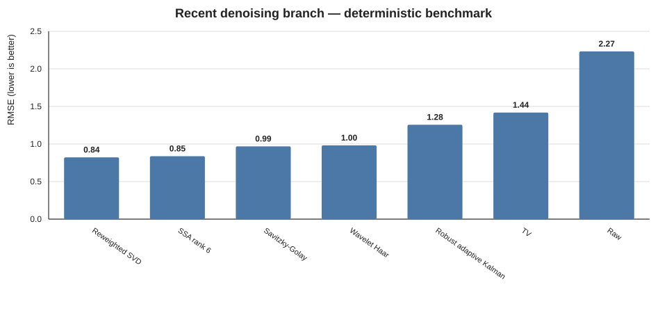

# Research notes — 2024–2026 denoising directions

This branch extends the repository beyond classical window filters and fixed-noise Kalman filtering. The goal is not to reproduce large research pipelines verbatim, but to isolate useful algorithmic ideas that can remain dependency-free in a small C# library.

## What changed in the literature

Recent signal-denoising work increasingly combines three ideas:

1. **adaptive decomposition** instead of one fixed low-pass filter;
2. **data-driven threshold/rank selection** instead of manually choosing a cutoff;
3. **time-varying noise estimation** instead of assuming one constant measurement-noise variance.

Representative recent work:

- Wang & Ding, *An Adaptive Signal Denoising Method Based on Reweighted SVD for the Fault Diagnosis of Rolling Bearings*, Sensors 2025, 25, 2470. DOI: https://doi.org/10.3390/s25082470
- *Adaptive SVD Denoising in Time Domain and Frequency Domain*, Applied Sciences 2025, 15, 12034. DOI: https://doi.org/10.3390/app152212034
- Wang et al., *Signal Denoising Method Based on EEMD and SSA Processing for MEMS Vector Hydrophones*, Micromachines 2024, 15, 1183. DOI: https://doi.org/10.3390/mi15101183
- Liu et al., *Electrostatic Signal Self-Adaptive Denoising Method Combined with CEEMDAN and Wavelet Threshold*, Aerospace 2024, 11, 491. DOI: https://doi.org/10.3390/aerospace11060491
- *An Improved Sage-Husa Variational Robust Adaptive Kalman Filter With Uncertain Noise Covariances*, IEEE Sensors Journal 2024, 24(18), 28921–28930. DOI: https://doi.org/10.1109/JSEN.2024.3421271
- Li et al., *Research on Signal Denoising of Pumped-Storage Units Based on Parameter-Adaptive VMD and Wavelet Thresholding*, Sensors 2026, 26, 3974. DOI: https://doi.org/10.3390/s26133974
- *Vibration Signal Denoising Method Based on ICFO-SVMD and Improved Wavelet Thresholding*, Sensors 2026, 26, 750. DOI: https://doi.org/10.3390/s26020750
- Rota et al., *Differentiable Time-Varying IIR Filtering for Real-Time Speech Denoising*, arXiv:2603.02794 (2026). https://arxiv.org/abs/2603.02794

The last three are useful as a roadmap: current research is moving toward automatically selected decompositions and time-varying filters. Full VMD/CEEMDAN/neural coefficient prediction would add a large amount of code and computational cost, so this branch first adds smaller building blocks that can be benchmarked against the existing filters.

## Added algorithms

### `WaveletHaarShrinkage`

Multilevel orthonormal Haar DWT, MAD estimate of the finest-band noise level, universal threshold and soft/hard shrinkage.

Use when: broadband high-frequency noise is mixed with transients or multi-scale structure.

Trade-offs: batch processing; Haar is intentionally simple and dependency-free, but smoother wavelets can preserve smooth shapes better.

### `SingularSpectrumAnalysis`

Hankel/trajectory embedding → eigendecomposition → truncated signal subspace → diagonal averaging.

Use when: the useful signal has a low-dimensional trend/oscillatory structure.

Trade-offs: much more expensive than EMA/Kalman and not intended for tiny microcontrollers.

### `ReweightedSvdDenoise`

SSA-style Hankel embedding with weighted singular-value shrinkage. The regularization can be supplied explicitly or estimated from the lower half of the singular spectrum.

This implementation is **inspired by** recent adaptive/reweighted-SVD work; it is a compact independent baseline, not a verbatim implementation of the 2025 papers above.

Use when: low-rank structure is present but hard rank truncation is too abrupt.

### `TotalVariationDenoise`

1D ROF total-variation denoising solved through a projected dual iteration.

Use when: piecewise-smooth or piecewise-constant signals contain important steps that a conventional low-pass filter would smear.

Trade-offs: staircasing can appear on naturally smooth ramps; it is iterative and offline in this implementation.

### `RobustAdaptiveKalman`

Scalar Kalman estimator with online measurement-noise adaptation and Huber-style innovation downweighting.

Use when: streaming sensor noise changes over time and occasional large outliers occur.

Trade-offs: still a scalar constant-state model; for position/velocity/IMU fusion use a proper multidimensional state model.

## Deterministic benchmark

Scenario: 600 samples at 50 Hz; two sinusoids, a step and slow drift; Gaussian noise σ=1.6; 22 deterministic impulsive outliers; seed `20260905`.



| Filter | RMSE | MAE | RMSE around spikes | RMSE outside spikes |
|---|---:|---:|---:|---:|
| Reweighted SVD | 0.8358 | 0.6339 | 1.5169 | 0.7168 |
| SSA rank 6 | 0.8523 | 0.6687 | **1.1597** | 0.8094 |
| Savitzky–Golay | 0.9850 | 0.7700 | 1.7747 | 0.8480 |
| Wavelet Haar | 0.9982 | 0.7426 | 1.7230 | 0.8770 |
| Robust adaptive Kalman | 1.2776 | 0.9933 | 1.2584 | 1.2798 |
| Total Variation | 1.4426 | 0.8230 | 3.8380 | 0.7895 |
| Raw | 2.2699 | 1.5154 | 5.2868 | 1.5891 |

This is not a universal ranking. In this synthetic scenario the low-rank structure strongly favors SSA/SVD. TV preserves the step but does not reject large impulses by itself. Adaptive Kalman is causal and therefore competes under a different constraint from the offline symmetric/decomposition methods.

Reproduce:

```bash
python tools/generate_recent_benchmark.py
```

Raw metrics: [`charts/recent_benchmark.csv`](charts/recent_benchmark.csv).

## Next research candidates

The most useful next experiments are:

- parameter-adaptive VMD + wavelet thresholding, reflecting 2026 industrial-vibration work;
- adaptive rank selection using the second-order singular-value difference spectrum rather than a fixed SSA rank;
- online/block SSA for bounded latency;
- multiresolution wavelets beyond Haar (Daubechies/Symlet) while keeping zero external runtime dependencies;
- time-varying IIR coefficient selection as a lightweight alternative to a full neural denoiser.
