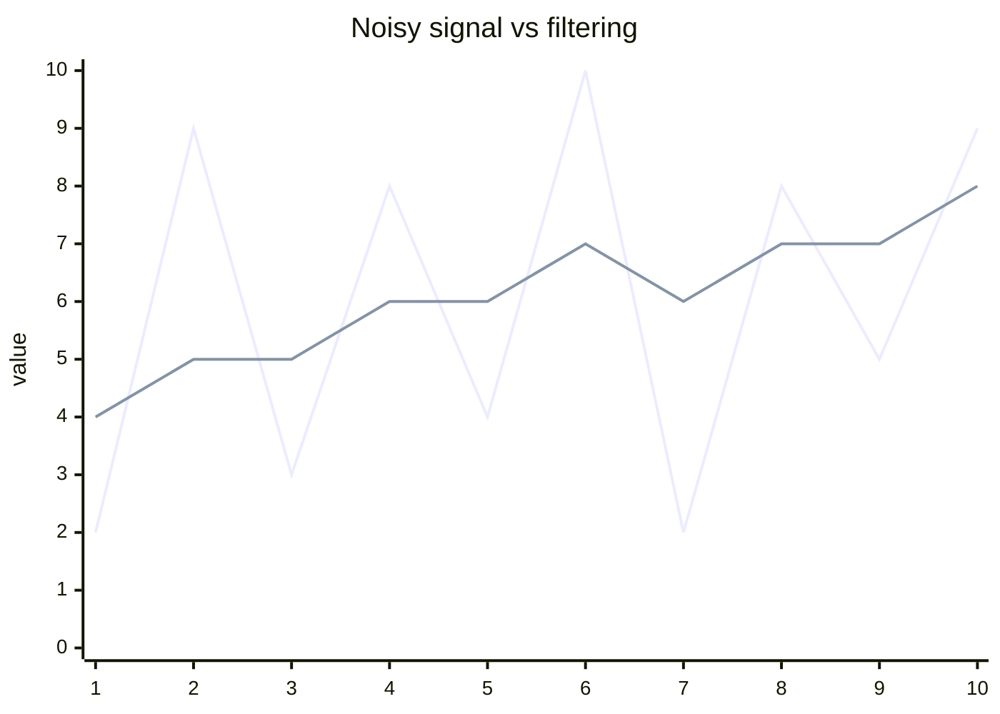

# Filter comparison

## Behavior

| Filter | Removes spikes | Preserves shape | Response |
|---|---|---|---|
| Moving average | medium | medium | slow |
| Median | excellent | good | medium |
| Kalman | good | excellent | adaptive |
| Hampel | excellent | excellent | event based |
